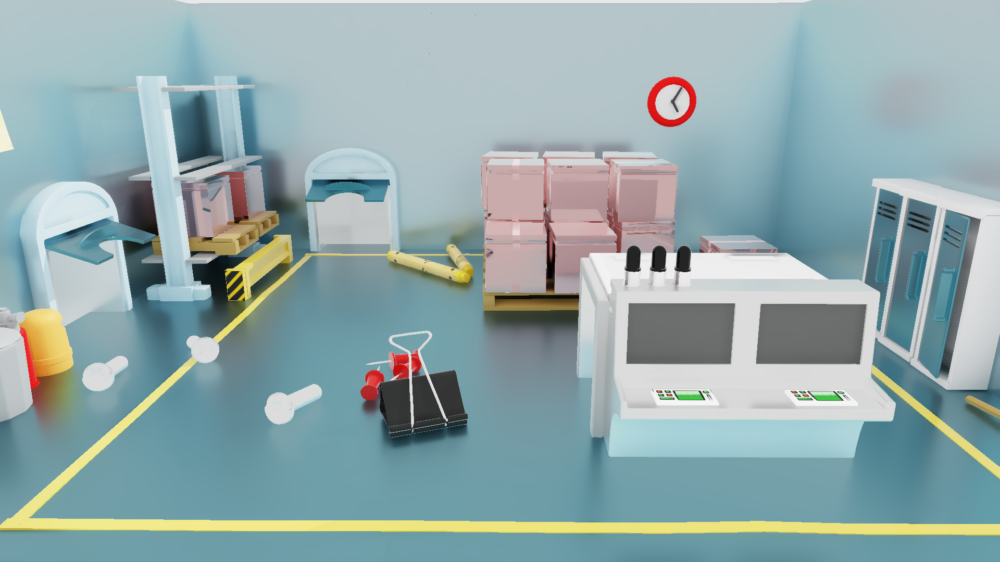
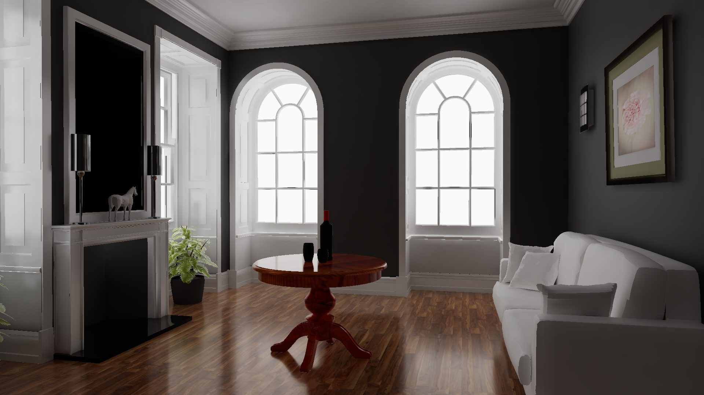
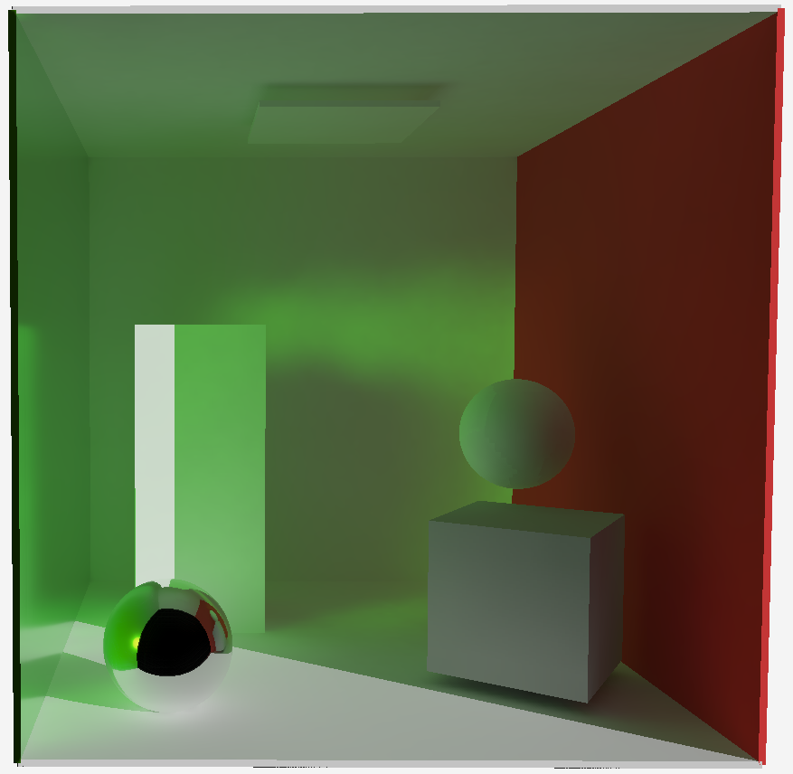
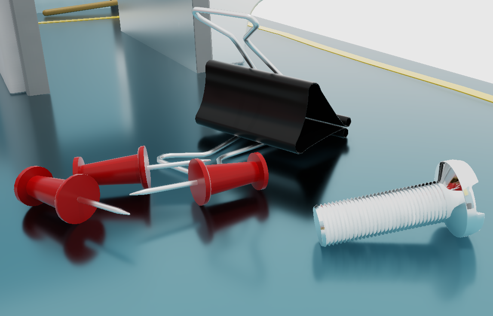
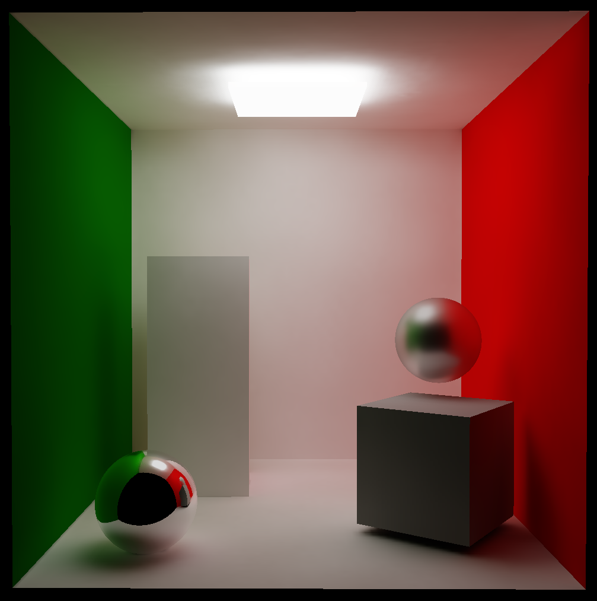

## Introduction
This repository contains the implementation of real-time global illumination techniques for my thesis. After my thesis, I have continued to improve the renderer with new features.

## Implemented Methods (Thesis)
1. Real-time Global Illumination by Precomputed Local Reconstruction from Sparse Radiance Probes
2. Denoised reflections using Spatiotemporal Variance-Guided Filtering
3. Screen-space blurred reflections using Screen-Space Roughness (disabled at the moment)

## Features (After thesis)
- [FidelityFX Super Resolution 2.0.1 (FSR 2.0)](https://github.com/GPUOpen-Effects/FidelityFX-FSR2)
- A custom Render Graph with:
  - Full Automatic pipeline creation
  - Image layout transitions
  - Barriers for images and buffers
  - Automatic resource binding (descriptor sets) 
  - A clean API (example usage: https://github.com/berksaribas/Panko-Renderer/blob/main/src/gi_deferred.cpp)

## Thesis Description

In the thesis, the base diffuse illumination method [1] was extended with real-time probe ray-tracing. The extended version supports dynamic occluders and emitters than can contribute to the diffuse illumination. Precomputed parts of the scene are limited with being static, thus they cannot be move. Materials and light sources are not precomputed, they can be freely modified.

For specular surfaces, two different specular reflections methods are implemented. The first approach uses SVGF [2] to denoised reflections. The SVGF algorithm was extended with Virtual hit point reprojection, Firefly rejection, Color-box clipping to improve the quality for specular reflections.

The second approach is an extended version of [3]. The method renders perfect mirror reflections and blurs the reflections into lower-res MIPs with a cross-bilateral filter. This approach is extended with blurred hit distances and missing sample filling technique to improve the results.

## Usage

The diffuse method depends on precomputations, so each new scene must be precomputed before used. The repository includes the precomputation data for the Cornell Box scene.

To precompute new scenes, the correct GLTF file should be loaded in `init_scene` function. Also, the following part of the code must be modified:

    bool loadPrecomputedData = false;
    if (!loadPrecomputedData) {
        precalculationInfo.voxelSize = 0.25;
        precalculationInfo.voxelPadding = 2;
        precalculationInfo.probeOverlaps = 10;
        precalculationInfo.raysPerProbe = 1000;
        precalculationInfo.raysPerReceiver = 40000;
        precalculationInfo.sphericalHarmonicsOrder = 7;
        precalculationInfo.clusterCoefficientCount = 32;
        precalculationInfo.maxReceiversInCluster = 1024;
        precalculationInfo.lightmapResolution = 261;
        precalculationInfo.texelSize = 6;
        precalculationInfo.desiredSpacing = 2;
    }

Most of these parameters do not require any modifications. Only the voxel size, lightmap resolution, texel size and desired spacing should be set by experiment for the scene.

After the precomputation `loadPrecomputedData` can be set as `true` to run the precomputed scene.

## Showcase

Bedroom Scene (Diffuse + SVGF Reflections)

Pica Pica Scene (Diffuse + SVGF Reflections)

Livingroom Scene (Diffuse + SVGF Reflections)

Soft Caustics (Real-time probe ray-tracing for soft caustics)

SVGF Reflections

Cornell Box (Diffuse + SVGF Reflections)

Screen-space Roughness Reflections (Blurred reflections)

## References

1.  Real-time Global Illumination by Precomputed Local Reconstruction from Sparse Radiance Probes
2.  Spatiotemporal Variance-Guided Filtering
3.  Ray-Traced Glossy Reflections Using Screen-Space Roughness, https://www.nvidia.com/en-us/on-demand/session/gtcfall20-a21792/
4.  Hybrid Rendering for Real-Time Ray Tracing, https://media.contentapi.ea.com/content/dam/ea/seed/presentations/2019-ray-tracing-gems-chapter-25-barre-brisebois-et-al.pdf
5.  Hybrid Rendering, https://github.com/diharaw/hybrid-rendering
6.  Vulkan Guide, https://vkguide.dev/

## LICENSE

Assets under this repository might have license that prohibit commercial use. However, the code published here can be used by complying to the LICENSE.
